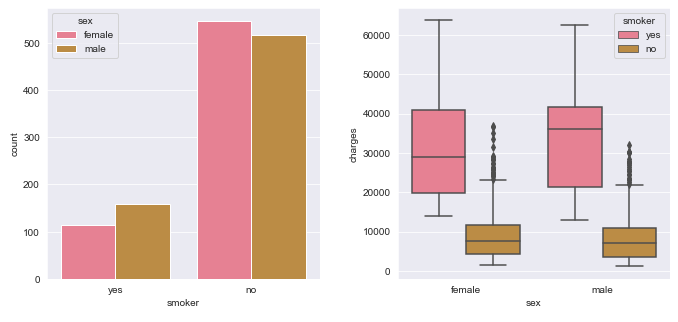
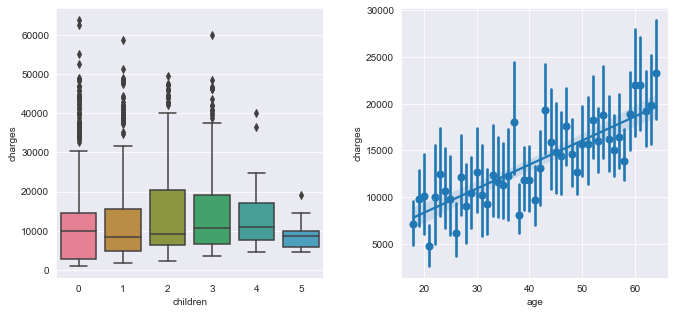

# Insurance expenses

We have the following features to predict the charges of a policyholder in an insurance company:
<ul>
<li> age: Age of the beneficiary.
<li> sex: Beneficiary's sex (female/male).
<li> bmi: Body mass index.
<li> children: Number of children covered by the insurance.
<li> smoker: Smoking (yes/no).
<li> region: The beneficiary's residential area in the US (northwest/northeast/southwest/southeast).
<li>charges: Individual medical costs billed by the insurance.
</ul>

## Exploratory analysis
Now lets analyze the relationship between the target variable and other features. 

    
From the above images we see that:
<ul>
    <li> Smokers have higher charges that non-smokers, independently of the sex, and smoking habits are more prevalent among males. 
    <li> Women present more variation in their charges: there is a noticeable difference between the charges of males and females in terms of their variance.
    <li> Males tend to spend more than women.
    <li> Charges increase as the population gets older.
    <li> There is no apparent difference in charges between regions and number of children.
    <li> There is a small indication that individuals with higher BMI spend more. 
    <li> There are no remarkable outliers.
</ul>

## Out of the box models

We used 1/3 of the observations as a test set and the rest to train the models. We compared multiple out-of-the box ML models by using cross-validation on the MSE and MEA mean and standard deviation as the measures of goodness of fit. The best ones were the random forest and the XGBoost regressor.

   

## Fine-tuning of XGBoost and Random forest regressors and comparison with neural networks

In this section we fine-tuned these two models using a random GridSearchCV to find their optimal parameters, and a Pipeline to control the workflow. The results can be observed in the table presented below. Finally, we compared the results with a neural network. After doing some testing, we concluded that we don't need a very deep network neither its layers need to have many neurons. We used a five layer neural network with 128 neurons on the first layer and 64 neurons on the other ones. Since we have a regression problem, the final laye rhad one neuron. We got almost as small errors with the neural network as the ones with the other models. Nevertheless, neural networks have a bigger variance in the MAE CV errors and also the computational time was much bigger. 

   

The conclusions are:

<ul>
    <li> An important factor is the smoking feature: the charges are much bigger on people that smokes that on people that don't. The coefficients found on lineal regression and Random Forest algorithms tell us that these two features are very important.
        <li>Random Forest gives a good and fast fit: the Random Forest algorithm give us the smallest errors in comparison to other models. Moreover, the time to train this model was also small. This model has a good equilibrium between accuracy and computational time for the data that we were analyzing.
    </ul>
